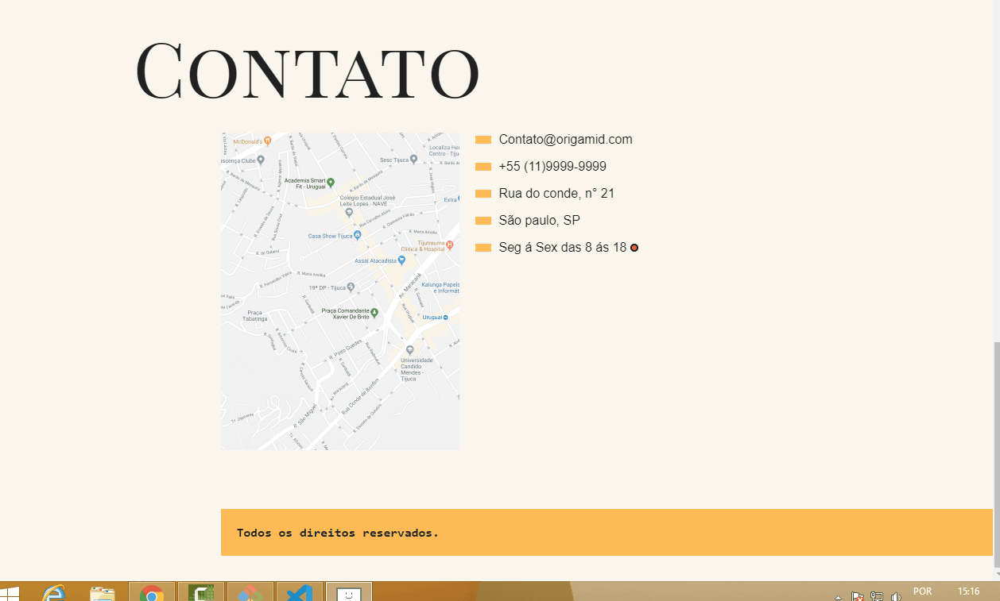

<h1 align="center">
  Projeto Origamid
</h1>

 
 

E simplesmente fantástico como podemos manipular datas com o constructor Date() do Javascript e ver se o estabelecimento está aberto entre tal horário me fez ver a tamanha importância que tem este constructor Date(), muito legal.

## 🚀 Tecnologias usadas:
### HTML
### CSS
### JAVASCRIPT

 
 

Feito com muito ❤️ por Brandon Carlos

